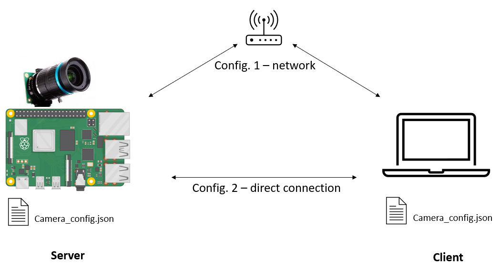

# Raspberry Pi Camera as UDP Camera
A server client application to use a raspberry pi with an attached CSI-camera as udp camera. A basic interface between the computer and the raspberry pi is provided to setup the camera-mode and control the exposure time. By that the raspberry pi+camera can be used in headless mode (without a display).

The Application is used to acquire mostly uncompressed images, depending on network speed and chosen image resolution the framerate might be rather low.

### Steps to start

- clone repo to raspberry pi and install requirements
- clone repo to computer and install requirements
- configure camera_config.json for the used camera (basic Hq camera provided)
- identify rpi ip address
- run camera_rpi.py on Server (RPI)
- run camera_pc.py on Client (Computer)